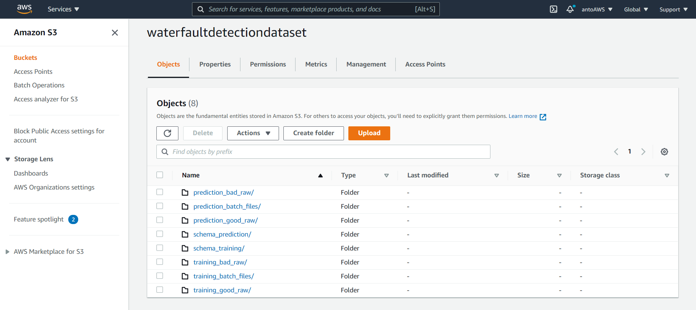
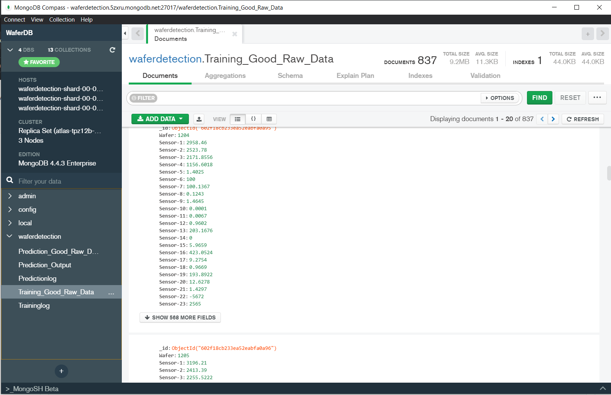
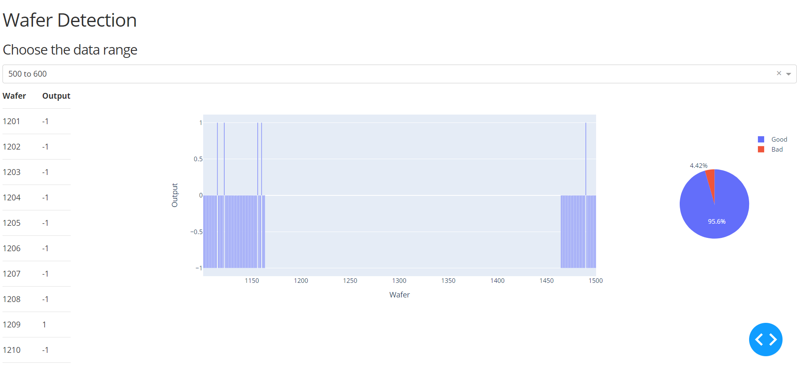

# Wafer_Detection_ML

# Problem Statement
To build a classification methodology to predict the quality of wafer sensors based on the given training data. 

# Data Description
The client will send data in multiple sets of files in batches at a given location.Data will contain wafer names and 590 columns of different sensor values for each wafer. The last column will have the 
"Good/Bad" value for each wafer
"Good/Bad" column will have two unique values +1 and -1
"+1" represents Bad wafer
"-1" represents God wafer

# Dataset
For dataset processing done via *AWS* bucket technique. Where we upload the files in separate folder in AWS.From our application establish AWS connection and process the each file individually. Afer the successful preprocessing moving the files to separate folder. 

# Database
Using MongoDB Atlas cloud storage for saving the logs used in training and prediction. Also, inserting the good data after preprocessing on training phase. On Prediction level inserting the wafer prediction with '-1'/'+1'.

# Dashboard
Finally, a dashboard composed of prediction data with visaulization part. In addition to chart rendering dynamically by change of input field.

